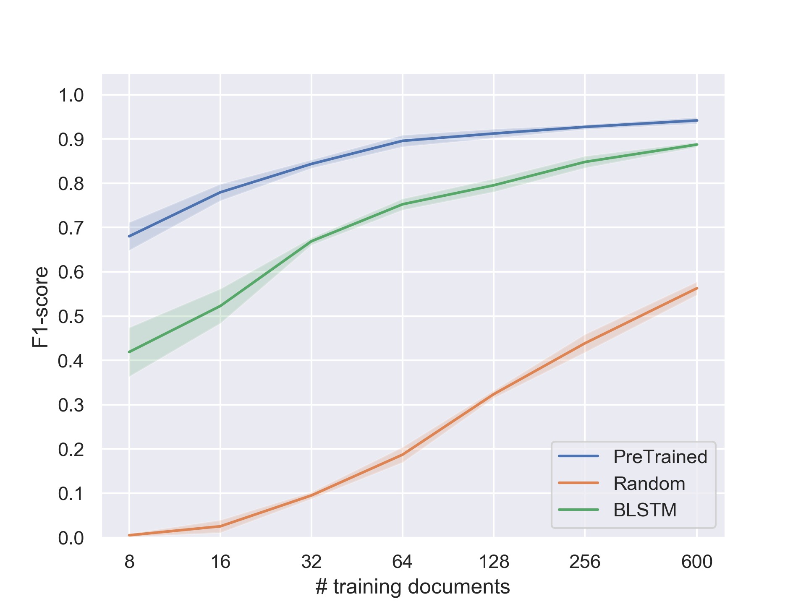

# LayoutLM
## Introduction

LayoutLM is a simple but effective multi-modal pre-training method of text, layout and image for visually-rich document 
understanding and information extraction tasks, such as form understanding and receipt understanding. 
LayoutLM achieves the SOTA results on multiple datasets. For more details, please refer to their paper: 

[LayoutLM: Pre-training of Text and Layout for Document Image Understanding](https://arxiv.org/abs/1912.13318)
Yiheng Xu, Minghao Li, Lei Cui, Shaohan Huang, Furu Wei, Ming Zhou, [KDD 2020](https://www.kdd.org/kdd2020/accepted-papers)

This repository is intended to provide insights on how a pre-trained language model like LayoutLM behaves when learning 
to perform these document analysis tasks from **few** annotated documents. As yet, we only assess Information Extraction 
(IE) tasks with experiments on the [SROIE benchmark](https://rrc.cvc.uab.es/?ch=13), which evaluates the ability 
to retrieve the company name and address, the total amount and date within receipts of diverse layouts. The classical 
approach for extracting information from documents is through sequence labeling with a classification head sitting 
on top of a neural encoder delivering contextualized representations of the document tokens.

On this dataset, we compare the extraction performance, measured by the test F1 scores averaged over the four targeted fields,
of the pre-trained LayoutLM against two randomly initialized models: its non-pretrained counterpart and a 2-layer 
bidirectional LSTM network. The comparison is performed for various numbers of SROIE receipts available for training 
the three models, from 8 documents until the full training set which is made of 600 samples.

## Pre-trained Models

LayoutLM has been pre-trained on the IIT-CDIP Test Collection 1.0 dataset with two settings: 

* LayoutLM-Base, Uncased (11M documents, 2 epochs): 12-layer, 768-hidden, 12-heads, 113M parameters || [OneDrive](https://1drv.ms/u/s!ApPZx_TWwibInS3JD3sZlPpQVZ2b?e=bbTfmM) | [Google Drive](https://drive.google.com/open?id=1Htp3vq8y2VRoTAwpHbwKM0lzZ2ByB8xM)
* LayoutLM-Large, Uncased (11M documents, 2 epochs): 24-layer, 1024-hidden, 16-heads, 343M parameters || [OneDrive](https://1drv.ms/u/s!ApPZx_TWwibInSy2nj7YabBsTWNa?e=p4LQo1) | [Google Drive](https://drive.google.com/open?id=1tatUuWVuNUxsP02smZCbB5NspyGo7g2g)

By default, we use the base LayoutLM in our evaluation script. To run it without modifications, download this version
and move the files to the path ```pre-trained-models/layoutlm-base-uncased```

## Fine-tuning on SROIE

Setup the environment as follows:

~~~bash
conda create -n layoutlm python=3.6
conda activate layoutlm
conda install pytorch==1.4.0 cudatoolkit=10.1 -c pytorch
git clone https://github.com/NVIDIA/apex && cd apex
pip install --no-cache-dir --global-option="--cpp_ext" --global-option="--cuda_ext" ./
pip install .
~~~

First, you need to download the SROIE dataset. As many submissions in the leaderboard have noticed, the 
[official dataset](https://rrc.cvc.uab.es/?ch=13&com=downloads) contains a number of brittle text recognition errors that
substantially impact the evaluation of the extraction task. Therefore, we have corrected most of the errors in the test 
set and provide this dataset version in this [Google Drive folder](https://drive.google.com/drive/folders/1T4E7HLOGhLZmEq2cTzXoYRR365qLfANw?usp=sharing).
Download the `raw_dataset.zip` archive and move it into the expected folder with the following instructions:
~~~bash
mkdir -p examples/seq_labeling/data/SROIE
mv raw_dataset.zip examples/seq_labeling/data/SROIE
~~~

Then, we need to preprocess the provided SROIE dataset for making it suitable for sequence labeling. Originally, the 
receipt text consists in a list of segments, we further tokenize at the subword level. Besides, the ground truth of the 
training documents is given at the field level, we transform it into token labels that represent the information 
type carried by each document token. To that end, you can run the preprocessing script `preprocess_SROIE.sh` in the 
`seq_labeling` directory:

~~~bash
cd examples/seq_labeling
./preprocess_SROIE.sh
~~~

After preprocessing, run the script 
[run_few_shot.sh](https://github.com/clemsage/unilm/blob/master/layoutlm/examples/seq_labeling/run_few_shot.sh) 
that alternately learns an extraction model from variable numbers of training receipts and then computes the 
predictions for all the test documents. As evoked in the introduction, three models are considered, they are referred 
as `PreTrained`, `Random` and `BLSTM`. Each experiment is repeated 5 times, with different random seeds and 
thus different subsets of the training set. For more information, please refer to this script.

~~~bash
./run_few_shot.sh
~~~

This script is expected to be run on a single GPU, see the 
[LayoutLM repository](https://github.com/microsoft/unilm/tree/master/layoutlm) for adapting this script 
to multiple GPUs with the `torch.distributed` package.

### Results
The `run_few_shot.sh` script outputs the post-processed test predictions of each experiment in the folder 
`output/predictions`. Each archive in this folder corresponds to a single experiment and can be submitted 
to the [SROIE platform](https://rrc.cvc.uab.es/?ch=13&com=mymethods&task=3) to obtain the extraction metrics, 
i.e. the averaged precision, recall and F1 score.
You can then manually report the test results into the file `metrics.py` and run it to plot the F1 scores according to
the number of training documents for the three models. By default, this saves the plot into the folder `output/plots`
but this can be modified with the `plots_path` argument. This should produce the following plot:



The averages of the 5 F1 scores are plotted as solid lines while the standard deviation are represented with the 
shaded regions around the means. We note that the convergence of LayoutLM is really fast, hitting more than 
80 % of its full performance with only 32 documents for fine-tuning. The pre-trained model is significantly more data 
efficient than the fully supervised models since, in the toughest data conditions, LayoutLM needs around 4 times fewer 
annotated documents than the BLSTM model for reaching the same level of performance.

## Citation

If you find our results useful in your research, please cite the following paper:

``` latex
@inproceedings{sage2021data,
  title   = {Data-Efficient Information Extraction from Documents with Pre-Trained Language Models},
  author  = {Sage, Cl{\'e}ment and Douzon, Thibault and Aussem, Alexandre and Eglin, V{\'e}ronique and Elghazel, Haytham and Duffner, Stefan and Garcia, Christophe and Espinas, J{\'e}r{\'e}my},
  journal = {Proceedings of the First Workshop on Document Images and Language (DIL)},
  year    = {2021}
}
```

In this paper, we have also conducted experiments on a dataset of real-world documents that unfortunately cannot be released here. Particularly, we have shown that the few-shot IE performance is improved on this private dataset when fine-tuning LayoutLM on the full SROIE training set beforehand. Please refer to our paper for more details about these experiments.

### License

This project is licensed under the license found in the LICENSE file in the root directory of this source tree.
Portions of the source code are based on the [transformers](https://github.com/huggingface/transformers) project.
[Microsoft Open Source Code of Conduct](https://opensource.microsoft.com/codeofconduct)

